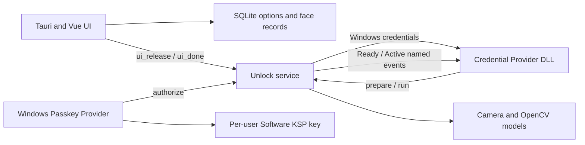

# Current Architecture

This document describes the active product architecture. Removed experiments are listed only as constraints and do not belong to the build.

## Components

### UI

The UI owns enrollment, settings, deployment, logs, updates, and Passkey management. It stores application state in SQLite and coordinates camera ownership before enrollment or verification.

When enabled, the enrollment consistency check runs a short, local, passive RGB
presentation-attack check. It uses model-correct face preprocessing and median
fusion across a small frame burst; it does not ask the user to blink, turn, or
perform another challenge. The check is not part of lock-screen recognition.

### Credential Provider

The DLL runs inside Windows authentication hosts. It advertises a tile only in configured scenarios, requests recognition from Unlock, receives a matched account credential, and serializes it for Windows.

Credential Provider APIs do not expose Chromium's prompt message. Broker classification therefore uses documented scenario flags, Win32 owner/root-owner context, explicit safe/unsafe text signals when available, private-window markers, registry policy, and the WebAuthn monitor state.

### Unlock Service

The scheduled task starts a SYSTEM supervisor and worker. The worker owns camera recognition, lock-screen prewarm, WebAuthn event monitoring, the Passkey face gate, and automatic locking.

The service does not call `LockWorkStation` from Session 0. It launches a one-shot helper under the active WTS user token on `winsta0\default`, then confirms the session lock flag.

### Passkey Provider

The optional MSIX is available only on Windows 11 24H2+. It creates and owns the WebAuthn credential key. FaceWinUnlock provides a one-operation authorization decision but never exports or substitutes a Windows Hello private key.

## IPC

| Name | Participants | Purpose |
|---|---|---|
| `MansonWindowsUnlockRustServer` | Credential Provider to Unlock | `prepare` and `run` recognition control; ambiguous broker scenes connect only after explicit input |
| `MansonWindowsUnlockRustUnlock` | Unlock, Credential Provider, UI | credentials, release and camera coordination, health/exit control |
| `FaceWinUnlockPasskeyFaceAuth` | Passkey plugin to Unlock | one face authorization request |
| `Global\FaceWinUnlockTauriWebAuthnReady` | Unlock to Credential Provider | monitor is healthy and contract-validated |
| `Global\FaceWinUnlockTauriWebAuthnActive` | Unlock to Credential Provider | at least one tracked WebAuthn transaction is active |

## Broker Decision Order

1. Active WebAuthn transaction: skip the generic Credential Provider.
2. Explicit passkey, security-key, WebAuthn, FIDO2, or PIN-setup signal: skip.
3. Browser login/authentication title with no serialized password credentials and the V2 CredUI
   flag: skip the generic Provider during Advise even before Active is published. Legacy 0x200
   password-fill requests remain eligible for the generic Provider.
4. Settings/biometric enrollment/private browser: disable unknown fallback.
5. Explicit password manager, reveal/show password, or fill-password signal: allow face.
6. Browser-owned Windows Hello PIN wording is treated as password fill only when the
   browser is allowlisted, the monitor is Ready and not Active, and
   `CREDUI_BROWSER_PASSWORD_FILL=1`; if the monitor is unavailable, the same wording
   fails closed to Windows PIN.
7. Unknown request: allow only for Chrome, Edge, Brave, Opera/Opera GX, Vivaldi, Chromium, or 360; monitor Ready; monitor not Active; non-private; `CREDUI_BROWSER_PASSWORD_FILL=1`.
8. Everything else: return `E_NOTIMPL` to Windows.

The Active check is repeated in `SetUsageScenario`, `Advise`, before pipe connection, before `prepare`, during recognition, and before credential submission. This closes the race where a WebAuthn transaction begins after initial enumeration.

For an explicitly identified password broker scene, the Credential Provider connects early and
sends `prepare` to warm the camera, but the first `run` still requires user mouse/keyboard input.
This preserves the fast Win+L-style camera path without allowing an opened dialog to authorize by
itself. Login-title prompts without serialized password credentials in V2 mode never start the
generic Provider; after the user confirms, the native browser/Passkey flow issues the single face
authorization. Legacy-mode (`0x200`) login-title password-fill prompts remain input-gated, but
retain mouse-movement activation for repeated fills. An ambiguous browser prompt must not connect
to Unlock,
prewarm the camera, or start face recognition merely because the prompt opened. After explicit
input, the normal `prepare`/guard/`run` sequence resumes. Login and lock-screen scenes also
continue to require user input before recognition. A browser that fills a saved
password directly in the page without opening Windows Security never calls the Credential
Provider; that path must be protected by the browser's own "Use Windows Hello when filling
passwords" setting and cannot be observed through UI Automation or input injection.
If a broker dialog is cancelled after `prepare`, teardown sends `release` from a background thread
to stop any in-flight camera open without blocking the host UI thread.

## Camera Lifecycle

- Lock-screen prewarm opens the configured camera before the first `run` where possible.
- No enabled face records means no prewarm.
- Prewarm releases after 45 seconds without a request.
- UI camera operations send `ui_release`; all completion/error paths send `ui_done`.
- Manual PIN unlock sends release and blocks same-session prewarm until credential-client transition confirms a new session.
- Auto-lock skips camera checks while the workstation is already locked.

## Data And Trust

- Face records, options, and configured Windows credentials remain local.
- The generic Credential Provider briefly handles account credentials to log on; it must never log serialization bytes or secret values.
- Passkey private keys are per-user Software KSP keys. Metadata backup is under `%ProgramData%\facewinunlock-tauri\PasskeyBackup`.
- Ordinary RGB face recognition and RGB passive liveness are convenience layers, not equivalent to Windows Hello biometric assurance.

## Removed Routes

- UI Automation and protected-dialog control inspection
- Keyboard/PIN injection and blind submission
- Browser extension WebAuthn interception and local HTTP signing
- Capturing or reconstructing Windows Hello passkey private keys
- Credential Provider DComp/D2D lock-screen animation

Upgrade/uninstall code may still delete historical files or registry values for these routes. Those cleanup references are intentional migration tombstones.
