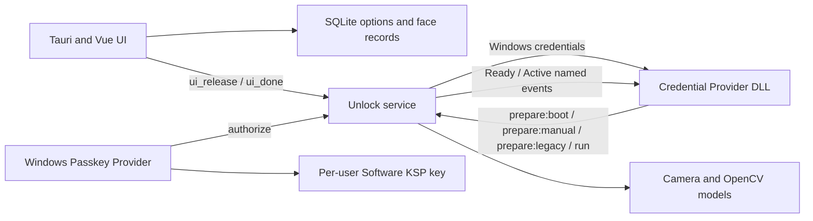

# Current Architecture

This document describes the active product architecture. Removed experiments are listed only as constraints and do not belong to the build.

## Components

### UI

The UI owns enrollment, settings, deployment, logs, updates, and Passkey management. It stores application state in SQLite and coordinates camera ownership before enrollment or verification.

### Credential Provider

The DLL runs inside Windows authentication hosts. It advertises a tile only in configured scenarios, requests recognition from Unlock, receives a matched account credential, and serializes it for Windows.

Credential Provider APIs do not expose Chromium's prompt message. Broker classification therefore uses documented scenario flags, Win32 owner/root-owner context, explicit safe/unsafe text signals when available, private-window markers, registry policy, and the WebAuthn monitor state.

For the primary logon/unlock scenes, the DLL selects one per-session trigger policy:

- `prepare:boot` is claimed only once per Windows boot, for an unattended `CPUS_LOGON` candidate with no recent keyboard/mouse input. The claim is stored as a non-sensitive per-boot marker under `%ProgramData%\facewinunlock-tauri\boot-sessions` so LogonUI or service restarts do not turn a later Win+L into an automatic unlock.
- `prepare:manual` is used for `CPUS_UNLOCK_WORKSTATION`, later logon candidates, recent-input candidates, and all uncertain cases. Recognition still requires the existing low-level input hook.
- `prepare:legacy` preserves the existing run-gated delay behavior for supported CREDUI password scenarios. It does not apply to the official Passkey provider.

The DLL never synthesizes keyboard/PIN input and never sends an automatic `run` command. In boot mode, Unlock starts the configured delay only after a credential client is connected; it performs at most three automatic attempts, then changes that session to input-only mode. A manual input cancels any pending boot timer.

### Unlock Service

The scheduled task starts a SYSTEM supervisor and worker. The worker owns camera recognition, lock-screen prewarm, WebAuthn event monitoring, the Passkey face gate, and automatic locking.

The service does not call `LockWorkStation` from Session 0. It launches a one-shot helper under the active WTS user token on `winsta0\default`, then confirms the session lock flag.

### Passkey Provider

The optional MSIX is available only on Windows 11 24H2+. It creates and owns the WebAuthn credential key. FaceWinUnlock provides a one-operation authorization decision but never exports or substitutes a Windows Hello private key.

## IPC

| Name | Participants | Purpose |
|---|---|---|
| `MansonWindowsUnlockRustServer` | Credential Provider to Unlock | Session policy (`prepare:boot`, `prepare:manual`, `prepare:legacy`) and input-triggered `run` |
| `MansonWindowsUnlockRustUnlock` | Unlock, Credential Provider, UI | credentials, release and camera coordination, health/exit control |
| `FaceWinUnlockPasskeyFaceAuth` | Passkey plugin to Unlock | one face authorization request |
| `Global\FaceWinUnlockTauriWebAuthnReady` | Unlock to Credential Provider | monitor is healthy and contract-validated |
| `Global\FaceWinUnlockTauriWebAuthnActive` | Unlock to Credential Provider | at least one tracked WebAuthn transaction is active |

## Broker Decision Order

1. Active WebAuthn transaction: skip the generic Credential Provider.
2. Explicit passkey, security-key, WebAuthn, FIDO2, or PIN-setup signal: skip.
3. Settings/biometric enrollment/private browser: disable unknown fallback.
4. Explicit password manager, reveal/show password, or fill-password signal: allow face.
5. Unknown request: allow only for Chrome, Edge, Brave, Opera/Opera GX, Vivaldi, Chromium, or 360; monitor Ready; monitor not Active; non-private; `CREDUI_BROWSER_PASSWORD_FILL=1`.
6. Everything else: return `E_NOTIMPL` to Windows.

The Active check is repeated in `SetUsageScenario`, `Advise`, before pipe connection, before `prepare`, during recognition, and before credential submission. This closes the race where a WebAuthn transaction begins after initial enumeration.

## Camera Lifecycle

- Lock-screen prewarm opens the configured camera before the first `run` where possible.
- Boot-delay mode may start recognition without user input, but only after the primary session policy is explicitly marked `prepare:boot` and the credential client is connected.
- Boot-delay mode is bounded to three automatic attempts; exhaustion arms the existing mouse/keyboard path and does not inject credentials.
- No enabled face records means no prewarm.
- Prewarm releases after 45 seconds without a request.
- UI camera operations send `ui_release`; all completion/error paths send `ui_done`.
- Manual PIN unlock sends release and blocks same-session prewarm until credential-client transition confirms a new session.
- Auto-lock skips camera checks while the workstation is already locked.

## Data And Trust

- Face records, options, and configured Windows credentials remain local.
- The generic Credential Provider briefly handles account credentials to log on; it must never log serialization bytes or secret values.
- Passkey private keys are per-user Software KSP keys. Metadata backup is under `%ProgramData%\facewinunlock-tauri\PasskeyBackup`.
- Ordinary RGB face recognition is a convenience layer, not equivalent to Windows Hello biometric assurance.

## Removed Routes

- UI Automation and protected-dialog control inspection
- Keyboard/PIN injection and blind submission
- Browser extension WebAuthn interception and local HTTP signing
- Capturing or reconstructing Windows Hello passkey private keys
- Credential Provider DComp/D2D lock-screen animation

Upgrade/uninstall code may still delete historical files or registry values for these routes. Those cleanup references are intentional migration tombstones.
