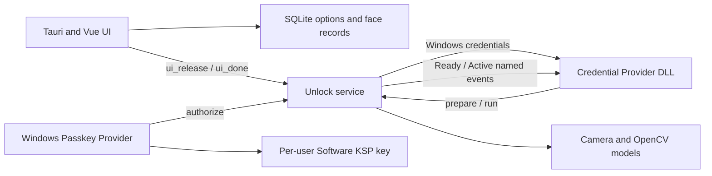

# Current Architecture

This document describes the active product architecture. Removed experiments are listed only as constraints and do not belong to the build.

## Components

### UI

The UI owns enrollment, settings, deployment, logs, updates, and Passkey management. It stores application state in SQLite and coordinates camera ownership before enrollment or verification.

### Credential Provider

The DLL runs inside Windows authentication hosts. It advertises a tile only in configured scenarios, requests recognition from Unlock, receives a matched account credential, and serializes it for Windows.

Credential Provider APIs do not expose Chromium's prompt message. Broker classification therefore uses documented scenario flags, Win32 owner/root-owner context, explicit safe/unsafe text signals when available, private-window markers, registry policy, and the WebAuthn monitor state.

### Unlock Service

The scheduled task starts a SYSTEM supervisor and worker. The worker owns camera recognition, lock-screen prewarm, WebAuthn event monitoring, the Passkey face gate, and automatic locking.

Before the worker releases a password credential or grants a Passkey face request, it requires an identity match and a passive presentation-attack-detection (PAD) decision for the same face. The PAD pipeline uses `anti-spoof-mn3` as the primary model and MiniFASNetV2 as an independent secondary model. It aggregates at least six samples over at least 350 ms, requires the candidate identity to stay stable, and does not ask the user to blink, turn, or speak. A spoof, an inconclusive window, a missing/corrupt model, or an inference error fails closed to the normal Windows PIN/password path.

CPU and OpenCL load the canonical ONNX assets. Intel NPU loads OpenVINO 2024.6 IR assets (`.xml` + `.bin`) so OpenCV does not have to import unsupported ONNX operators. Every accelerated backend performs a real detector, recognizer, and PAD forward pass before it becomes active; deferred device-compilation failures fall back to CPU.

Automatic-lock presence checks intentionally use identity recognition without PAD: that path can only postpone a lock and can never release a credential or authorize a Passkey.

The service does not call `LockWorkStation` from Session 0. It launches a one-shot helper under the active WTS user token on `winsta0\default`, then confirms the session lock flag.

### Passkey Provider

The optional MSIX is available only on Windows 11 24H2+. It creates and owns the WebAuthn credential key. FaceWinUnlock provides a one-operation authorization decision but never exports or substitutes a Windows Hello private key.

## IPC

| Name | Participants | Purpose |
|---|---|---|
| `MansonWindowsUnlockRustServer` | Credential Provider to Unlock | `prepare` and `run` recognition control |
| `MansonWindowsUnlockRustUnlock` | Unlock, Credential Provider, UI | credentials, release and camera coordination, health/exit control |
| `FaceWinUnlockPasskeyFaceAuth` | Passkey plugin to Unlock | one face authorization request |
| `Global\FaceWinUnlockTauriWebAuthnReady` | Unlock to Credential Provider | monitor is healthy and contract-validated |
| `Global\FaceWinUnlockTauriWebAuthnActive` | Unlock to Credential Provider | at least one tracked WebAuthn transaction is active |

## Broker Decision Order

1. Active WebAuthn transaction: skip the generic Credential Provider.
2. Explicit passkey, security-key, WebAuthn, FIDO2, or PIN-setup signal: skip.
3. Settings/biometric enrollment/private browser: disable unknown fallback.
4. Explicit password manager, reveal/show password, or fill-password signal: allow face.
5. Unknown request: allow only for Chrome, Edge, Brave, Opera/Opera GX, Vivaldi, Chromium, or 360; monitor Ready; monitor not Active; non-private; `CREDUI_BROWSER_PASSWORD_FILL=1`.
6. Everything else: return `E_NOTIMPL` to Windows.

The Active check is repeated in `SetUsageScenario`, `Advise`, before pipe connection, before `prepare`, during recognition, and before credential submission. This closes the race where a WebAuthn transaction begins after initial enumeration.

## Camera Lifecycle

- Lock-screen prewarm opens the configured camera before the first `run` where possible.
- No enabled face records means no prewarm.
- Prewarm releases after 45 seconds without a request.
- UI camera operations send `ui_release`; all completion/error paths send `ui_done`.
- Manual PIN unlock sends release and blocks same-session prewarm until credential-client transition confirms a new session.
- Auto-lock skips camera checks while the workstation is already locked.

## Data And Trust

- Face records, options, and configured Windows credentials remain local.
- Passive PAD inference and its rolling decision window remain local; camera frames and model scores are not written to logs.
- The generic Credential Provider briefly handles account credentials to log on; it must never log serialization bytes or secret values.
- Passkey private keys are per-user Software KSP keys. Metadata backup is under `%ProgramData%\facewinunlock-tauri\PasskeyBackup`.
- RGB recognition with passive PAD materially reduces printed-photo and screen-replay attacks, but remains a convenience layer and is not equivalent to Windows Hello IR/depth biometric assurance.

## Removed Routes

- UI Automation and protected-dialog control inspection
- Keyboard/PIN injection and blind submission
- Browser extension WebAuthn interception and local HTTP signing
- Capturing or reconstructing Windows Hello passkey private keys
- Credential Provider DComp/D2D lock-screen animation

Upgrade/uninstall code may still delete historical files or registry values for these routes. Those cleanup references are intentional migration tombstones.
